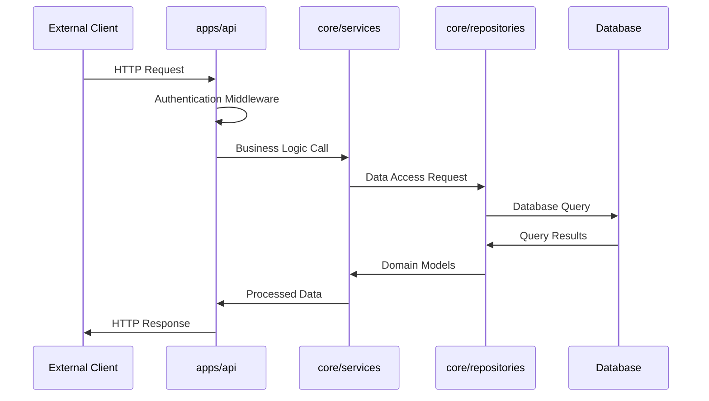
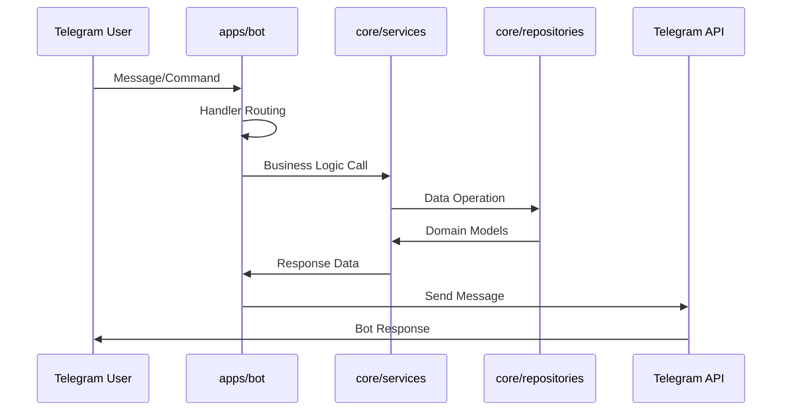
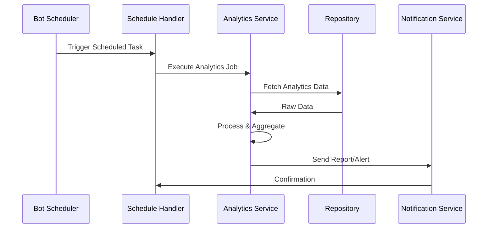
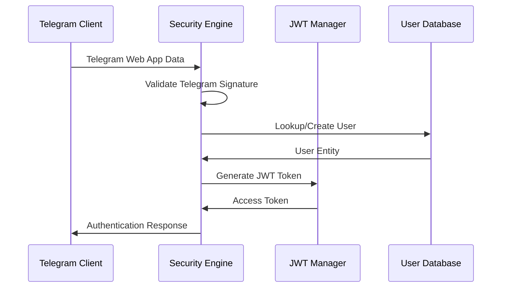

# AnalyticBot Architecture Guide

This document provides a comprehensive overview of the AnalyticBot architecture, explaining the layered design pattern, component responsibilities, and typical application flows.

## 🏗️ **Architecture Overview**

AnalyticBot follows a **clean layered architecture** pattern with clear separation of concerns across three main layers:

```
┌─────────────────────────────────────────────────────────────┐
│                     apps/ (Application Layer)               │
│  ┌─────────────┐  ┌─────────────┐  ┌─────────────────────┐  │
│  │  apps/api   │  │  apps/bot   │  │   apps/frontend     │  │
│  │   FastAPI   │  │   Aiogram   │  │      React TWA      │  │
│  │  HTTP API   │  │ Telegram    │  │  (Telegram Web App) │  │
│  │             │  │     Bot     │  │                     │  │
│  └─────────────┘  └─────────────┘  └─────────────────────┘  │
└─────────────────────────────────────────────────────────────┘
                              │
                              ▼
┌─────────────────────────────────────────────────────────────┐
│                  core/ (Business Logic Layer)               │
│  ┌─────────────┐  ┌─────────────┐  ┌─────────────────────┐  │
│  │    models   │  │   services  │  │    repositories     │  │
│  │   Domain    │  │  Business   │  │    Data Access      │  │
│  │   Models    │  │   Logic     │  │      Layer          │  │
│  └─────────────┘  └─────────────┘  └─────────────────────┘  │
│  ┌─────────────────────────────────────────────────────────┐  │
│  │               security_engine/                          │  │
│  │            Authentication & Authorization               │  │
│  └─────────────────────────────────────────────────────────┘  │
└─────────────────────────────────────────────────────────────┘
                              │
                              ▼
┌─────────────────────────────────────────────────────────────┐
│                 infra/ (Infrastructure Layer)               │
│  ┌─────────────┐  ┌─────────────┐  ┌─────────────────────┐  │
│  │   docker/   │  │ db/alembic/ │  │        k8s/         │  │
│  │ Containers  │  │ Database    │  │     Kubernetes      │  │
│  │             │  │ Migrations  │  │     Manifests       │  │
│  └─────────────┘  └─────────────┘  └─────────────────────┘  │
│  ┌─────────────────────────────────────────────────────────┐  │
│  │                  monitoring/                            │  │
│  │         Prometheus, Grafana, Alerting                  │  │
│  └─────────────────────────────────────────────────────────┘  │
└─────────────────────────────────────────────────────────────┘
```

## 📋 **Layer Responsibilities**

### Applications Layer (`apps/`)

The applications layer contains the entry points and user interfaces for the system.

#### `apps/api/` - FastAPI Web Application
**Purpose**: HTTP API server providing RESTful endpoints for web clients and external integrations.

**Key Components**:
- `main.py`: FastAPI application factory and configuration
- `deps.py`: Dependency injection setup for services and repositories
- `routers/`: API endpoint implementations organized by domain
- `middleware/`: Cross-cutting concerns (auth, CORS, logging)

**Responsibilities**:
- HTTP request/response handling
- API endpoint definition and routing
- Request validation and response serialization
- Authentication middleware integration
- CORS and security header management

#### `apps/bot/` - Telegram Bot Application  
**Purpose**: Telegram bot interface for direct user interaction within Telegram.

**Key Components**:
- `run_bot.py`: Bot application entry point and event loop
- `handlers/`: Message and callback handlers organized by functionality
- `schedule_handlers.py`: Scheduled task handlers for periodic operations
- `deps.py`: Dependency injection for bot-specific services

**Responsibilities**:
- Telegram API integration via Aiogram
- Message parsing and command processing
- Interactive keyboard and callback handling
- Background task scheduling and execution
- User state management

#### `apps/frontend/` - React Telegram Web App
**Purpose**: Rich web interface accessed through Telegram Web App framework.

**Key Components**:
- `src/components/`: React components for UI elements
- `src/pages/`: Page-level components and routing
- `src/services/`: API client and data fetching logic
- `src/utils/`: Utility functions and helpers

**Responsibilities**:
- Interactive web UI within Telegram
- Real-time data visualization and charts
- User dashboard and analytics presentation
- Telegram Web App API integration

### Business Logic Layer (`core/`)

The core layer contains domain logic, business rules, and data access patterns.

#### `core/models/` - Domain Models
**Purpose**: Represent business entities and their relationships.

**Key Components**:
- `user.py`: User entity with authentication and profile data
- `channel.py`: Telegram channel representation
- `analytics.py`: Analytics data models and aggregations
- `base.py`: Base model classes with common functionality

**Responsibilities**:
- Domain entity definition
- Business rule validation
- Data integrity constraints
- Model relationships and associations

#### `core/services/` - Business Services
**Purpose**: Implement business logic and orchestrate operations across multiple domains.

**Key Components**:
- `analytics_service.py`: Analytics computation and reporting
- `user_service.py`: User management and authentication workflows
- `channel_service.py`: Channel management operations
- `notification_service.py`: Communication and alerting logic

**Responsibilities**:
- Business process orchestration
- Complex business logic implementation
- Cross-domain operation coordination
- External service integration

#### `core/repositories/` - Data Access Layer
**Purpose**: Abstract data persistence and provide clean interfaces for data operations.

**Key Components**:
- `user_repository.py`: User data persistence operations
- `analytics_repository.py`: Analytics data access and aggregation
- `base_repository.py`: Common repository patterns and utilities

**Responsibilities**:
- Data persistence abstraction
- Query optimization and caching
- Database transaction management
- Data access pattern implementation

#### `core/security_engine/` - Security Framework
**Purpose**: Handle authentication, authorization, and security-related operations.

**Key Components**:
- `telegram_auth.py`: Telegram Web App authentication
- `jwt_manager.py`: JWT token generation and validation
- `permissions.py`: Role-based access control
- `crypto.py`: Encryption and security utilities

**Responsibilities**:
- User authentication and session management
- Authorization and permission checking
- Security token management
- Cryptographic operations

### Infrastructure Layer (`infra/`)

The infrastructure layer manages deployment, persistence, and operational concerns.

#### `infra/docker/` - Container Configuration
**Purpose**: Container definitions and multi-stage build optimization.

**Key Components**:
- `Dockerfile`: Multi-stage Python application container
- `docker-compose.yml`: Development and production orchestration
- `nginx/`: Reverse proxy and static file serving

#### `infra/db/` - Database Management  
**Purpose**: Database schema management and migration control.

**Key Components**:
- `alembic/`: Database migration scripts and version control
- `models/`: SQLAlchemy ORM model definitions
- `migrations/`: Auto-generated and custom migration files

#### `infra/k8s/` - Kubernetes Deployment
**Purpose**: Production-ready Kubernetes manifests for scalable deployment.

**Key Components**:
- `deployments/`: Application deployment configurations
- `services/`: Service discovery and load balancing
- `configmaps/`: Configuration management
- `secrets/`: Sensitive data management

#### `infra/monitoring/` - Observability Stack
**Purpose**: Application and infrastructure monitoring, alerting, and observability.

**Key Components**:
- `prometheus/`: Metrics collection and alerting rules
- `grafana/`: Dashboard definitions and visualization
- `alerts/`: Alert routing and notification configuration

## 🔄 **Typical Application Flows**

### 1. API Request Flow


**Flow Description**:
1. External client sends HTTP request to FastAPI application
2. Authentication middleware validates request and extracts user context
3. API router delegates to appropriate business service
4. Service implements business logic and calls repository for data
5. Repository executes database queries and returns domain models
6. Service processes data and applies business rules
7. API serializes response and returns to client

### 2. Telegram Bot Message Flow


**Flow Description**:
1. User sends message or command to Telegram bot
2. Aiogram framework routes message to appropriate handler
3. Handler delegates business logic to core services
4. Service processes request and interacts with repositories
5. Repository performs data operations and returns models
6. Service prepares response data for bot
7. Bot formats and sends response via Telegram API

### 3. Scheduled Task Flow


**Flow Description**:
1. Bot scheduler triggers periodic task execution
2. Schedule handler coordinates background job processing
3. Analytics service fetches and processes data
4. Repository provides access to raw analytics data
5. Service aggregates data and applies business rules
6. Notification service delivers reports or alerts
7. Handler receives confirmation and logs results

## 🔒 **Security Architecture**

### Authentication Flow


### Authorization Layers
1. **Transport Security**: TLS/HTTPS for all communications
2. **Authentication**: Telegram Web App signature validation
3. **Authorization**: JWT-based session management
4. **Data Access**: Repository-level permission checking
5. **API Security**: Rate limiting and input validation

## 📊 **Data Flow Patterns**

### Read Operations (Queries)
```
Client Request → API Auth → Service Logic → Repository Query → Database
                                    ↓
Client Response ← Response Formatting ← Business Logic ← Domain Models
```

### Write Operations (Commands)
```
Client Request → API Validation → Service Logic → Repository Save → Database
                                        ↓
Background Jobs ← Event Publishing ← Transaction Commit ← Data Persistence
```

### Background Processing
```
Scheduler Trigger → Task Handler → Service Logic → Repository Access
                                        ↓
Notification Send ← Result Processing ← Business Logic ← Data Processing
```

## 🎯 **Design Principles**

### 1. **Dependency Inversion**
- High-level modules (services) don't depend on low-level modules (repositories)
- Both depend on abstractions (interfaces)
- Dependencies flow inward toward the business logic

### 2. **Single Responsibility**
- Each layer has a single, well-defined responsibility
- Components are focused and cohesive
- Changes in one layer don't affect others

### 3. **Interface Segregation**  
- Small, focused interfaces rather than large, monolithic ones
- Clients depend only on methods they actually use
- Easy to mock and test individual components

### 4. **Open/Closed Principle**
- Open for extension (new features) via dependency injection
- Closed for modification of core business logic
- New functionality added without changing existing code

## 🧪 **Testing Strategy**

### Layer-Specific Testing
- **Applications**: Integration tests for API endpoints and bot handlers
- **Business Logic**: Unit tests for services with mocked repositories  
- **Data Access**: Repository tests with test database fixtures
- **Infrastructure**: Container and deployment validation tests

### Cross-Layer Testing
- **End-to-End**: Full user workflow validation
- **Integration**: Cross-layer component interaction testing
- **Performance**: Load testing and benchmark validation

## 🚀 **Deployment Architecture**

### Development Environment
```
Local Machine → Poetry Environment → PostgreSQL + Redis → Hot Reload
```

### Production Environment  
```
Load Balancer → Kubernetes Ingress → Pod Replicas → Managed Database
                                           ↓
Monitoring Stack ← Logs & Metrics ← Application Containers
```

### Scaling Strategies
- **Horizontal**: Multiple API/Bot pod replicas
- **Vertical**: Resource allocation per container
- **Database**: Connection pooling and read replicas
- **Caching**: Redis for frequently accessed data

---

This architecture provides a robust foundation for the AnalyticBot platform, enabling maintainable code, testable components, and scalable deployment across various environments.
