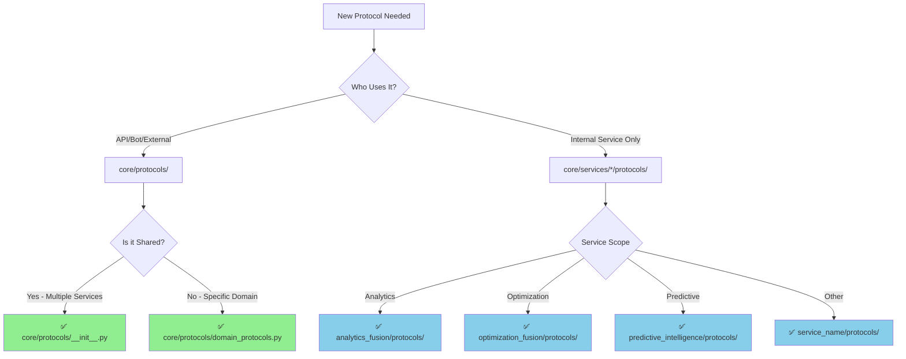
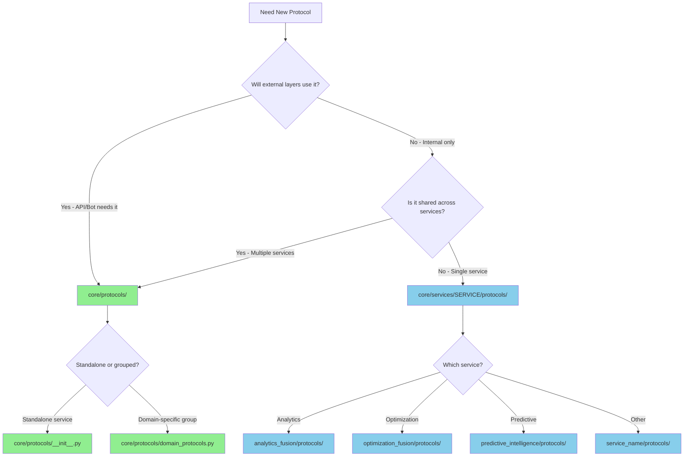

# Protocol Architecture Visual Guide

## 🎯 Quick Reference: Where Do Protocols Go?



---

## 📊 Two-Tier Protocol Architecture

```
┌─────────────────────────────────────────────────────────────────────────┐
│                           EXTERNAL LAYER                                 │
│                                                                           │
│  ┌──────────────┐  ┌──────────────┐  ┌──────────────┐  ┌────────────┐ │
│  │  apps/api/   │  │  apps/bot/   │  │  apps/jobs/  │  │  External  │ │
│  │   routers/   │  │   handlers/  │  │   tasks/     │  │   Clients  │ │
│  └──────┬───────┘  └──────┬───────┘  └──────┬───────┘  └──────┬─────┘ │
│         │                 │                 │                 │         │
│         └─────────────────┴─────────────────┴─────────────────┘         │
└─────────────────────────────────┬───────────────────────────────────────┘
                                   │ depends on
                                   ↓
┌─────────────────────────────────────────────────────────────────────────┐
│                         TIER 1: PUBLIC PROTOCOLS                         │
│                         📁 core/protocols/                               │
├─────────────────────────────────────────────────────────────────────────┤
│                                                                           │
│  Public API Contracts (Ports)                                           │
│  ├─ ServiceProtocol                    ← Base for all services          │
│  ├─ AnalyticsServiceProtocol           ← Public analytics API           │
│  ├─ AnalyticsFusionServiceProtocol     ← Public fusion API              │
│  ├─ OptimizationOrchestratorProtocol   ← Public optimization API        │
│  ├─ PredictiveOrchestratorProtocol     ← Public predictive API          │
│  ├─ RedisClientProtocol                ← Shared infrastructure          │
│  └─ DatabaseServiceProtocol            ← Shared database                │
│                                                                           │
│  Characteristics:                                                        │
│  • Stable interfaces (rarely change)                                    │
│  • Consumed by external layers                                          │
│  • Define "what" the service provides                                   │
│  • High-level policy                                                    │
│                                                                           │
└─────────────────────────────────┬───────────────────────────────────────┘
                                   │ implemented by
                                   ↓
┌─────────────────────────────────────────────────────────────────────────┐
│                              ADAPTERS LAYER                              │
│                     core/services/*/service.py                           │
├─────────────────────────────────────────────────────────────────────────┤
│                                                                           │
│  Service Implementations (Adapters)                                     │
│  ├─ AnalyticsFusionService              implements ServiceProtocol      │
│  ├─ OptimizationFusionService           implements OrchProtocol         │
│  ├─ PredictiveIntelligenceService       implements PredictiveProtocol   │
│  └─ AdaptiveLearningService             implements LearningProtocol     │
│                                                                           │
│  Role: Orchestrate internal components to fulfill public API contract  │
│                                                                           │
└─────────────────────────────────┬───────────────────────────────────────┘
                                   │ coordinates
                                   ↓
┌─────────────────────────────────────────────────────────────────────────┐
│                      TIER 2: INTERNAL PROTOCOLS                          │
│                   📁 core/services/*/protocols/                          │
├─────────────────────────────────────────────────────────────────────────┤
│                                                                           │
│  Domain Implementation Contracts (Internal Ports)                       │
│                                                                           │
│  analytics_fusion/protocols/                                            │
│  ├─ AnalyticsCoreProtocol              ← Internal analytics engine      │
│  ├─ DataProcessorProtocol              ← Internal data processing       │
│  ├─ MetricsProcessorProtocol           ← Internal metrics calculation   │
│  ├─ OrchestratorProtocol               ← Internal orchestration         │
│  └─ RequestRouterProtocol              ← Internal routing               │
│                                                                           │
│  optimization_fusion/protocols/                                         │
│  ├─ PerformanceAnalysisProtocol        ← Internal performance analysis  │
│  ├─ OptimizationApplicationProtocol    ← Internal optimization logic    │
│  └─ ValidationProtocol                 ← Internal validation            │
│                                                                           │
│  predictive_intelligence/protocols/                                     │
│  ├─ ContextualAnalysisProtocol         ← Internal contextual analysis   │
│  ├─ TemporalIntelligenceProtocol       ← Internal temporal patterns     │
│  └─ PredictiveModelingProtocol         ← Internal ML modeling           │
│                                                                           │
│  Characteristics:                                                        │
│  • Can change frequently (implementation details)                       │
│  • Not exposed to external layers                                       │
│  • Define "how" the service works internally                            │
│  • Low-level implementation                                             │
│                                                                           │
└─────────────────────────────────────────────────────────────────────────┘
```

---

## 🔄 Adapter Pattern in Action

### Example: How RecommendationEngineProtocol Works

```python
# ========================================
# TIER 1: Public Protocol (core/protocols/optimization_protocols.py)
# ========================================
@runtime_checkable
class RecommendationEngineProtocol(Protocol):
    """Public API - Simple interface for external clients"""

    @abstractmethod
    async def generate_recommendations(
        self,
        channel_id: int
    ) -> list[OptimizationRecommendation]:
        """Generate optimization recommendations"""
        ...

# ========================================
# ADAPTER: Service Implementation (core/services/optimization_fusion/service.py)
# ========================================
class OptimizationFusionService:
    """Implements public protocol by coordinating internal components"""

    def __init__(
        self,
        performance_analyzer: PerformanceAnalysisProtocol,  # Internal!
        recommendation_engine: InternalRecommendationEngine,  # Internal!
        validator: ValidationProtocol,  # Internal!
    ):
        self.performance_analyzer = performance_analyzer
        self.recommendation_engine = recommendation_engine
        self.validator = validator

    async def generate_recommendations(
        self,
        channel_id: int
    ) -> list[OptimizationRecommendation]:
        """Public API implementation"""
        # Step 1: Analyze performance (internal)
        performance = await self.performance_analyzer.analyze(channel_id)

        # Step 2: Generate recommendations (internal)
        recommendations = await self.recommendation_engine.generate(performance)

        # Step 3: Validate (internal)
        validated = await self.validator.validate(recommendations)

        return validated

# ========================================
# TIER 2: Internal Protocol (optimization_fusion/protocols/optimization_protocols.py)
# ========================================
@runtime_checkable
class PerformanceAnalysisProtocol(Protocol):
    """Internal contract - Detailed interface for domain logic"""

    @abstractmethod
    async def analyze_baseline(
        self,
        channel_id: int,
        timeframe: str,
        metrics: list[str],
    ) -> PerformanceBaseline:
        """Analyze performance baseline with detailed metrics"""
        ...

    @abstractmethod
    async def compare_to_benchmark(
        self,
        baseline: PerformanceBaseline,
        benchmark_type: str,
    ) -> ComparisonResult:
        """Compare to industry benchmarks"""
        ...

    # Many more internal methods...
```

**Key Insight**:
- **Public protocol** = Simple, stable interface (what external clients need)
- **Internal protocols** = Detailed, flexible interfaces (how service implements it)
- **Service** = Adapter that bridges public API to internal implementation

---

## 📁 File Organization Best Practices

### ✅ Good Organization (Current State)

```
core/
├── protocols/                          # Tier 1: Public APIs
│   ├── __init__.py                     # ← Base service protocols
│   ├── optimization_protocols.py       # ← Shared optimization
│   └── predictive_protocols.py         # ← Shared predictive
│
└── services/                           # Service implementations
    ├── analytics_fusion/
    │   ├── service.py                  # ← Implements public protocol
    │   ├── protocols/                  # ← Tier 2: Internal contracts
    │   │   ├── analytics_protocols.py
    │   │   ├── orchestrator_protocols.py
    │   │   └── reporting_protocols.py
    │   └── components/                 # ← Implements internal protocols
    │       ├── analytics_engine.py
    │       ├── orchestrator.py
    │       └── report_generator.py
    │
    ├── optimization_fusion/
    │   ├── service.py                  # ← Implements public protocol
    │   ├── protocols/                  # ← Tier 2: Internal contracts
    │   │   └── optimization_protocols.py
    │   └── components/
    │       ├── performance_analyzer.py
    │       └── recommendation_engine.py
    │
    └── predictive_intelligence/
        ├── service.py                  # ← Implements public protocol
        ├── protocols/                  # ← Tier 2: Internal contracts
        │   └── predictive_protocols.py
        └── components/
            ├── contextual_analyzer.py
            └── temporal_analyzer.py
```

### ❌ Anti-Pattern (Don't Do This)

```
# DON'T: Mix public and internal protocols
core/
├── protocols/
│   ├── __init__.py                     # Public + Internal mixed ❌
│   ├── analytics_internal.py           # Internal in public space ❌
│   └── optimization_internal.py        # Internal in public space ❌

# DON'T: Expose internal protocols to external layers
apps/
└── api/
    └── routers/
        └── analytics.py
            from core.services.analytics_fusion.protocols import AnalyticsCoreProtocol  # ❌

# DO: Only depend on public protocols
apps/
└── api/
    └── routers/
        └── analytics.py
            from core.protocols import AnalyticsServiceProtocol  # ✅
```

---

## 🔍 Decision Tree: Where Should My Protocol Go?



---

## 🎓 Examples of Each Type

### Public Protocols (core/protocols/)

```python
# These are consumed by API routers, bot handlers, external services
ServiceProtocol                    # Base for all services
AnalyticsServiceProtocol           # Analytics public API
AnalyticsFusionServiceProtocol     # Fusion public API
RedisClientProtocol                # Shared cache interface
DatabaseServiceProtocol            # Shared database interface
PaymentServiceProtocol             # Payment integration API
```

**Usage**:
```python
# apps/api/routers/analytics.py
from core.protocols import AnalyticsServiceProtocol  # ✅ Public protocol

@router.get("/analytics/{channel_id}")
async def get_analytics(
    channel_id: int,
    analytics_service: AnalyticsServiceProtocol = Depends(get_analytics_service)
):
    return await analytics_service.get_channel_metrics(channel_id)
```

### Internal Protocols (core/services/*/protocols/)

```python
# These are used only within the service boundary
AnalyticsCoreProtocol              # Analytics engine internals
DataProcessorProtocol              # Data processing internals
MetricsProcessorProtocol           # Metrics calculation internals
PerformanceAnalysisProtocol        # Performance analysis internals
ContextualAnalysisProtocol         # Contextual analysis internals
```

**Usage**:
```python
# core/services/analytics_fusion/service.py
from .protocols.analytics_protocols import AnalyticsCoreProtocol  # ✅ Internal

class AnalyticsFusionService:
    def __init__(
        self,
        analytics_core: AnalyticsCoreProtocol,  # Internal dependency
        data_processor: DataProcessorProtocol,  # Internal dependency
    ):
        self.core = analytics_core
        self.processor = data_processor
```

---

## 🚀 Migration Guide: If You Need To Reorganize

### Scenario: Protocol is in wrong location

**If Internal Protocol is in core/protocols/**:

```bash
# 1. Move the protocol
mv core/protocols/internal_protocol.py \
   core/services/SERVICE_NAME/protocols/internal_protocol.py

# 2. Update imports in service files
# From: from core.protocols import InternalProtocol
# To:   from .protocols.internal_protocol import InternalProtocol

# 3. Ensure no external layers import it
# Check apps/api/, apps/bot/, apps/jobs/
```

**If Public Protocol is in service/protocols/**:

```bash
# 1. Move the protocol
mv core/services/SERVICE_NAME/protocols/public_protocol.py \
   core/protocols/public_protocol.py

# 2. Update imports in external layers
# From: from core.services.SERVICE.protocols import PublicProtocol
# To:   from core.protocols import PublicProtocol

# 3. Update service internal imports
# Update to import from core.protocols instead
```

---

## ✅ Validation Checklist

Use this to validate protocol organization:

```bash
# Check 1: External layers only import from core/protocols/
grep -r "from core.services" apps/api apps/bot apps/jobs
# Should return: NO RESULTS ✅

# Check 2: Service files can import from their own protocols/
grep -r "from .protocols" core/services/
# Should return: MANY RESULTS ✅

# Check 3: No circular dependencies
# Public protocols should NOT import from service protocols
grep -r "from core.services" core/protocols/
# Should return: NO RESULTS ✅

# Check 4: Services can import public protocols
grep -r "from core.protocols" core/services/
# Should return: SOME RESULTS ✅ (for implementing public APIs)
```

---

## 📚 References

- [Clean Architecture](https://blog.cleancoder.com/uncle-bob/2012/08/13/the-clean-architecture.html)
- [Hexagonal Architecture](https://alistair.cockburn.us/hexagonal-architecture/)
- [Ports and Adapters Pattern](https://jmgarridopaz.github.io/content/hexagonalarchitecture.html)
- [Python Protocols (PEP 544)](https://peps.python.org/pep-0544/)

---

**Last Updated**: 2025-01-XX
**Maintained By**: Architecture Team
